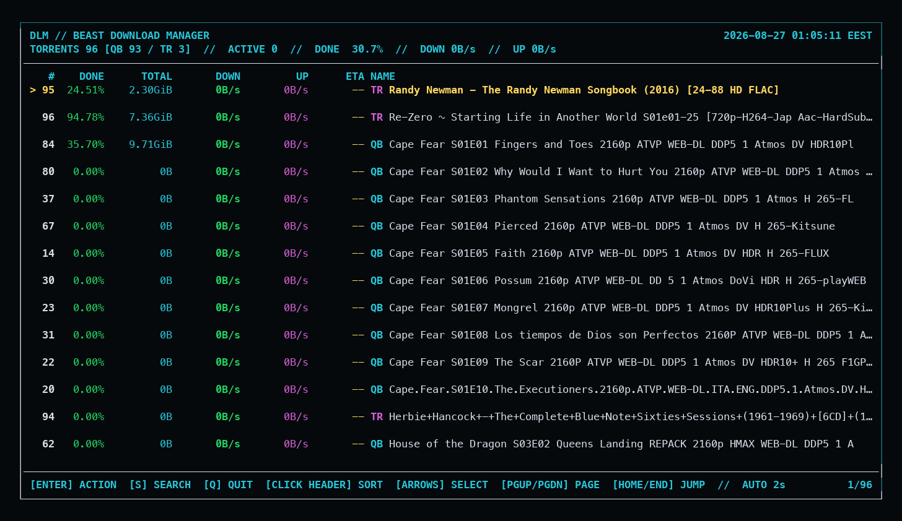
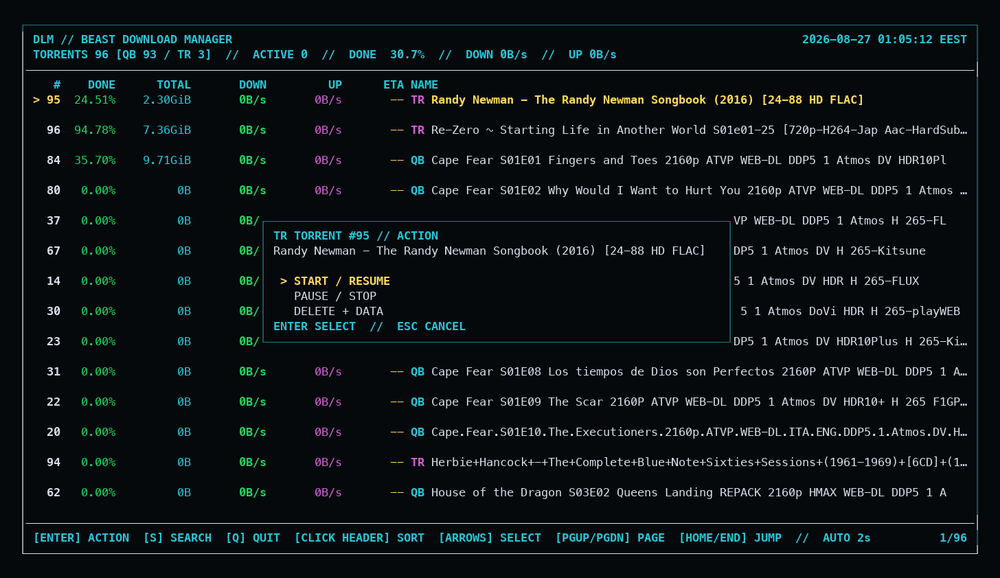

# DLM

DLM is a dependency-free, full-screen terminal client for managing torrents
from qBittorrent and Transmission in one queue. It provides readable live
progress, persistent numeric torrent IDs, confirmed destructive removal, and
configurable non-stalled qBittorrent queue controls.

```text
   #    DONE      TOTAL       DOWN         UP      ETA NAME
------------------------------------------------------------------------
>  1   4.21%    5.86GiB   585KiB/s       0B/s    2h40m QB Example release

   2  18.34%    4.68GiB       0B/s       0B/s       -- TR Legacy release…
------------------------------------------------------------------------
     9.89%   10.54GiB   585KiB/s       0B/s       -- TOTAL (2)
```

## Interface



The source badge makes every entry unambiguous: `QB` is qBittorrent and `TR`
is Transmission. The dashboard above is a current capture from Beast.



Transmission torrents use the same immediate keyboard action menu as
qBittorrent torrents.

## Features

- concise `DONE`, `TOTAL`, `DOWN`, `UP`, `ETA`, and `NAME` display;
- one combined list for qBittorrent and Transmission, identified by fixed
  cyan `QB` and magenta `TR` badges;
- full-screen retro dashboard with a bordered layout and live queue totals;
- color-coded columns and spacing between torrent entries;
- high-contrast torrent numbers and a yellow `>` selection marker;
- clickable `#`, `DONE`, `DOWN`, `UP`, `ETA`, and `NAME` sorting headers;
- clickable `ACTIVE` and top-line `DOWN` controls for changing qBittorrent's
  active-download count and global download-speed limit;
- keyboard-only scrolling; mouse-wheel events are ignored;
- name search with live filtering;
- paste and validate a magnet URI directly from the dashboard with `a`, then
  add it to qBittorrent's managed download queue;
- an Enter-key action menu for starting, pausing/stopping, or deleting selected
  qBittorrent and Transmission torrents;
- every torrent stays on one data row with a blank spacer beneath it;
- long names are truncated with an ellipsis; Right Arrow toggles scrolling for
  the selected torrent name only;
- persistent numeric IDs, so commands never require torrent hashes;
- automatic refresh plus keyboard navigation and refresh controls;
- low-latency menus and Escape cancellation with input prioritized over refresh;
- stop every qBittorrent torrent and restart its managed queue from the
  terminal;
- delete a selected qBittorrent or Transmission torrent together with all of
  its downloaded files from the dashboard;
- Python standard library only—no runtime packages.

## Requirements

- Python 3.10 or newer;
- qBittorrent with its Web UI enabled;
- optionally, a local or network-accessible Transmission RPC service;
- a credentials file containing:

```ini
username=your-qbittorrent-user
password=your-qbittorrent-password
```

Protect the credentials file with `chmod 600`.

## Installation

Clone the repository and run:

```sh
./install.sh
```

This installs `dlm` into `~/.local/bin`. On a typical Linux login shell that
directory is already in `PATH`. Otherwise add this to `~/.profile`:

```sh
export PATH="$HOME/.local/bin:$PATH"
```

The same installation can be performed manually:

```sh
install -Dm755 dlm.py "$HOME/.local/bin/dlm"
```

## Configuration

DLM reads these optional environment variables:

| Variable | Default on Beast | Purpose |
| --- | --- | --- |
| `DLM_QBITTORRENT_URL` | `http://192.168.1.27:8080` | qBittorrent Web UI base URL |
| `DLM_TRANSMISSION_URL` | `http://127.0.0.1:9091/transmission/rpc` | Transmission RPC URL; set to an empty value to disable |
| `DLM_CREDENTIALS_FILE` | `/media/nicolas/beast22/appdata/media-stack/qbittorrent.credentials` | Credentials file |
| `DLM_STATE_FILE` | `~/.local/state/dlm/torrents.json` | Persistent numeric-ID state |

For another machine, configure the first two variables in your shell profile:

```sh
export DLM_QBITTORRENT_URL="http://127.0.0.1:8080"
export DLM_CREDENTIALS_FILE="$HOME/.config/dlm/qbittorrent.credentials"
```

Colors are enabled automatically on interactive terminals. Set `NO_COLOR=1`
to disable them.

## Commands

Open the full-screen torrent dashboard. The two commands are equivalent:

```sh
dlm
dlm list
```

The dashboard merges qBittorrent and Transmission torrents into one numbered
list. A fixed `QB` or `TR` badge identifies the source, and the header reports
both source totals. Transmission is optional: if its daemon is unavailable,
the qBittorrent dashboard continues to work.

The first torrent is selected automatically with a yellow `>` marker and
high-contrast number/name instead of a reverse-video white bar. Long names are
initially truncated with an ellipsis. Press Right Arrow to start scrolling the
selected name, then press Right Arrow again to stop and return to its beginning.
Selecting another torrent stops name scrolling automatically. Use Up/Down or
`j`/`k` to select another torrent. Held arrow keys are clamped safely at the
first and last torrent. Mouse-wheel events are ignored, so scrolling is
keyboard-only.

Click `#`, `DONE`, `DOWN`, `UP`, `ETA`, or `NAME` to reorder the visible
torrents. `#` sorts by DLM's persistent torrent number across both clients.
The first click sorts high-to-low (`Z` to `A` for names); another click on the
same heading reverses the order. A `▼` or `▲` beside the active heading shows
the current direction. Unknown ETAs always remain below known ETAs.

The top status line also has two controls. Click `ACTIVE` to set qBittorrent's
maximum number of simultaneous downloads; stalled torrents remain excluded
from that limit. Click the top-line `DOWN` value to set the global download
speed. Plain numbers are interpreted as KiB/s, `K`, `M`, and `G` suffixes are
accepted, and `-1` removes the speed limit. Esc cancels either prompt.
Mouse-wheel scrolling remains disabled.

- Page Up/Page Down move by one visible page;
- Home or `g` selects the first torrent;
- End or `G` selects the final torrent;
- Ctrl+Up jumps to the first torrent and Ctrl+Down jumps to the final torrent;
- Right Arrow toggles scrolling for the selected torrent's name;
- two quick Up presses move one page up, while two quick Down presses move one
  page down; a single arrow press still moves immediately by one torrent;
- `r` refreshes immediately.

Press `s` to search torrent names. Every space-separated search word must
appear in the name. Press Enter to apply the search. Esc cancels search entry;
once a search is active, Esc clears it and restores the full list.

Press `a` to open the `ADD MAGNET TO QUEUE` dialog. Paste a complete
`magnet:?` URI and press Enter. DLM validates that it contains a BitTorrent v1
or v2 `xt` identifier, reapplies the managed queue preferences, and submits it
to qBittorrent. The torrent starts when a download slot is available; otherwise
it remains queued. Invalid input stays in the dialog for correction, and Esc
cancels without adding anything.

Press Enter on any selected torrent to open its action menu:

- `START / RESUME` starts the selected torrent;
- `PAUSE / STOP` stops the selected torrent;
- `DELETE + DATA` removes the torrent and its downloaded files after a second
  confirmation dialog.

For a `QB` entry, start is governed by DLM's configured qBittorrent active-
download limit. For a `TR` entry, DLM sends `torrent-start`, `torrent-stop`, or
`torrent-remove` to Transmission's RPC service using that torrent's actual
Transmission ID. Destructive removal sets `delete-local-data=true`, so
`DELETE + DATA` permanently removes the Transmission torrent and its media
from Beast.

Use the arrow keys and Enter inside a menu. Esc is the consistent cancel/clear
key for search, action menus, and delete confirmation. Press `q` to close DLM.
qBittorrent 5.2 has one stop operation rather than separate pause and stop
operations, so DLM labels that action `PAUSE / STOP`.

Choose another refresh interval:

```sh
dlm list --watch 5
```

Show only started, active, or stalled jobs:

```sh
dlm list --active
```

Print a traditional one-shot listing without opening the dashboard:

```sh
dlm list --plain
```

Stop all qBittorrent jobs:

```sh
dlm stop
```

Restart all incomplete jobs under the managed queue settings:

```sh
dlm start
```

Remove the job shown as `12` by `dlm list`:

```sh
dlm remove 12
```

`remove` displays the torrent name and asks for confirmation, then sends
`deleteFiles=true` to qBittorrent. This permanently deletes the job and its
downloaded files from the qBittorrent host. This command is qBittorrent-
specific; use a selected `TR` torrent's dashboard action menu for Transmission.
To skip the prompt deliberately:

```sh
dlm remove 12 --yes
```

## Queue behavior

`dlm start` applies the following qBittorrent preferences before restarting
incomplete jobs:

- queueing enabled;
- maximum active downloads: `1`;
- maximum active uploads: `1`;
- slow or stalled torrents do not count toward the download limit;
- overall active-torrent limit: unlimited, allowing the queue to advance past
  stalled jobs;
- share ratio limit: `0`, with the stop action.

Completed jobs remain stopped when the queue is restarted.

## Testing

Run the standard-library test suite:

```sh
python3 -m unittest -v test_dlm.py
```

## License

[MIT](LICENSE)
